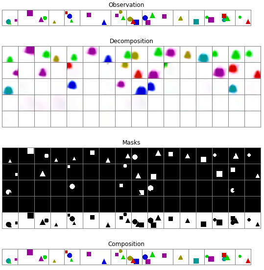

# Object representation learning

This repository contains a PyTorch implementation of the [MultiObject Network (MONet)](https://arxiv.org/abs/1901.11390). MONet is a model trained to explain a scene in a fixed number of steps, which allows it to reconstruct objects separately, even when they are occluded by other objects:

<div align="center">
</br></br>
</div>

## Instructions

### 1. Set up environment

Create a conda environment with all the requirements (edit `environment.yml` if you want to change the name of the environment):

```sh
conda env create -f environment.yml
```

Activate the environment

```sh
source activate pytorch
```

### 2. Generate data

We use [Sacred](https://sacred.readthedocs.io/en/latest/index.html) to log the experiments and also as a command line interface. To generate the sprites dataset, from the `data` folder run

```sh
python data.py generate_sprites_multi
```


### 3. Train model

With the default options, the training script trains MONet with 5 slots, using a VAE with a latent dimension of 10. Training takes around 4 hours on GPU:

```sh
python train.py
```
```
